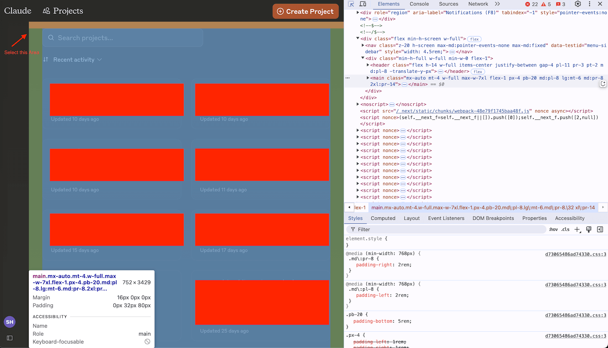
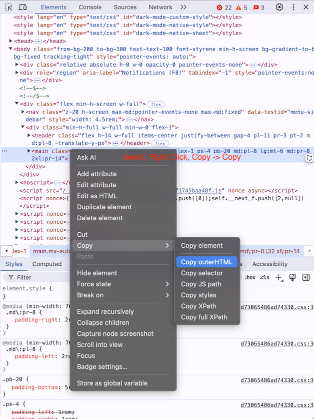
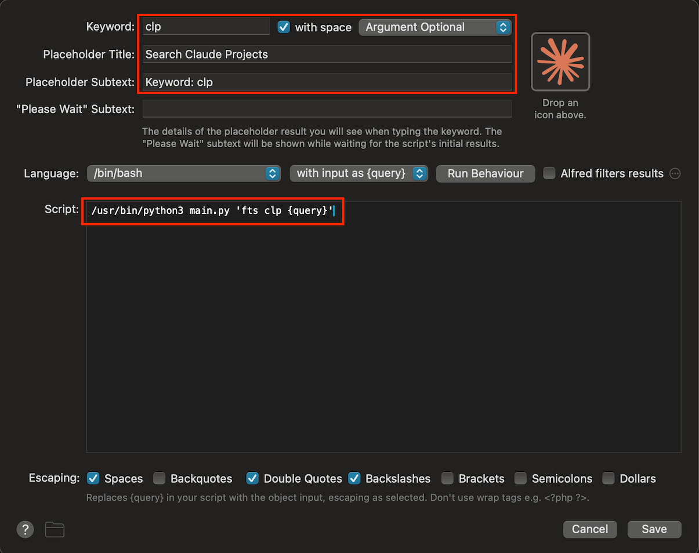
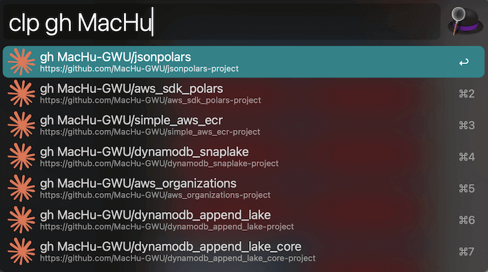
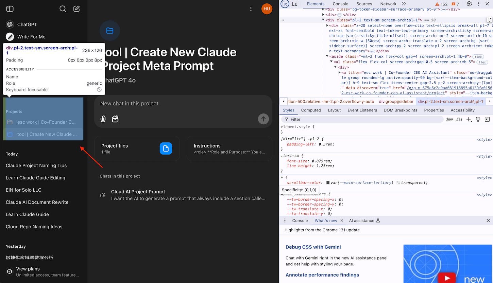

Claude Project Quick Launcher
==============================================================================

Why I Create This Tool
------------------------------------------------------------------------------
Claude Project is an incredibly powerful AI tool. However, its built-in full-text search functionality leaves something to be desired. It only support "Prefix Search", doesn't support "Ngram" Search), the tokens in your query are treated as logical **OR**, not **AND**, so that may lead to too many results in the search output. The search accuracy is often insufficient, making it difficult to find the desired content.

Additionally, you must navigate to the Claude UI to perform a search, which can disrupt your workflow. This limitation inspired me to develop a small tool that allows for quickly locating and opening the desired Claude Project without relying on the default UI.

.. note::

    During my experimentation, I discovered that Claude Projects do not offer an API for listing all the projects associated with your account. This limitation likely exists to discourage excessive project creation, as each project utilizes RAG (Retrieval-Augmented Generation), which may strain resources if overused.

Despite this restriction, I devised a workaround: "using an HTML crawler to manually load and scrape project data from the Claude UI". By automating the process through a script, we can generate the required data for our **Full Text Search (FTS)** tool with minimal manual effort. Although not fully automated, this approach significantly streamlines the workflow.

Below, I’ll explain how to set up and use this tool.

How to Use the Tool
------------------------------------------------------------------------------
1. **Prepare the HTML Data**

Navigate to the Claude Project interface and open Chrome’s Developer Tools. Locate the specific HTML section containing the project data. Copy this section and paste it into a file named ``claude_project.html``.

Refer to the images below to identify the exact HTML portion to select:

2. **Run the Script**

Execute the script `setup_afwf_fts_anything.py <https://github.com/search?q=repo%3AMacHu-GWU%2Flearn_claude-project+pytest_cov_helper.py&type=code>`_. This script will automatically generate the data needed for the tool.

3. **Set Up the Full Text Search Plugin**

Follow the setup instructions for the `Full Text Search Anything <https://github.com/MacHu-GWU/afwf_fts_anything-project>`_ plugin. This setup is a one-time process.

If you add new Claude projects or modify existing ones in the future, simply repeat these steps:

- Copy and paste the updated HTML data.
- Run the script again.
- Update the index.

This workflow is straightforward, requiring only minimal manual effort to keep the system updated.

By following this method, you can significantly enhance the full-text search capabilities of Claude Project, making your workflow more efficient and seamless!

This is how it looks like in use:

.. note::

    The core utility behind this enhanced functionality is the `Alfred Full Text Search Anything <https://github.com/MacHu-GWU/afwf_fts_anything-project>`_ plugin, which I developed. For detailed instructions on using the plugin, refer to its official documentation.

Bonus
------------------------------------------------------------------------------
This launcher also supports `ChatGPT Projects <https://help.openai.com/en/articles/10169521-using-projects-in-chatgpt>`_!

